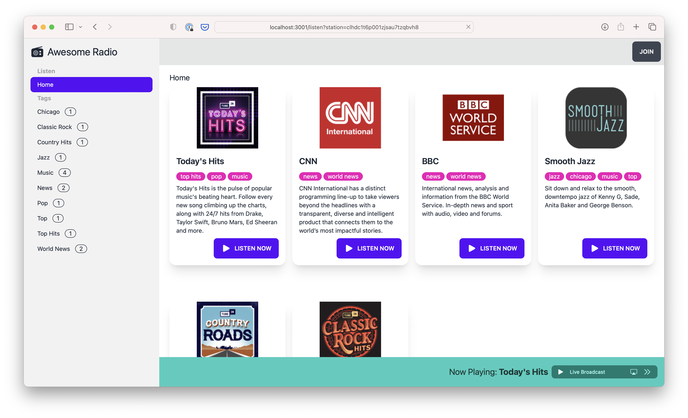

# Awesome Radio

[](https://github.com/wmluke/awesome-radio/actions/workflows/deploy.yml)

Awesome Radio is a personal internet radio station aggregator. See the [demo](https://awesome-radio-1ae3.fly.dev).



## Features

* Browse radio stations by tag
* Listen while navigating
* Fully responsive UI for mobile, tablets, and desktop
* Light and dark theme automatically enabled by OS settings
* Deep linking for all UI actions
* User accounts
* Add content sources to import stations

## Roadmap

* Support user favorites
* Support importing from other source types
* Support manually adding/editing/disabling stations
* Support [PWA](https://web.dev/progressive-web-apps/) to allow user to save to home screen on mobile devices
* User profile page
* Fix: Primary drawer stays open after navigation
* Fix: Station id in deep-link url...should be station slug
* Fix: Missing form validation and error handling
* Tech Debt: Add more unit and E2E tests

## Development

### Tech Stack

* [Remix](https://remix.run): React SSR web framework
* [SQLite](https://www.sqlite.org): File based relational database
* [Prisma](https://www.prisma.io/): Node TS ORM
* [Vitest](https://vitest.dev): Unit test framework
* [Cypress](https://www.cypress.io): Browser automation test framework
* [Tailwind CSS](https://tailwindcss.com): CSS utility framework
* [DaisyUI](https://daisyui.com/): Component CSS library built with Tailwind
* [PostCSS](https://postcss.org): CSS pre-processor
* [Typescript](https://www.typescriptlang.org/): Typed Javascript

### Project Structure Summary

```
.
├── .github/              Deployment workflow to fly.io    
├── app/                  Main app folder...contains components, routes, etc   
│   ├── models      Primsa DB queries
│   ├── root.tsx    Root of the Remix UI
│   └── routes      File based http routing         
├── cypress/              Cypress E2E tests 
├── prisma/               DB ORM: db migrations and seed
└── public/               Public static assets
```

### Getting Started

1. Create `.env` file from `.env.example`

```shell
cp .env.example .env
```

2. Install dependencies

```shell
npm install
```

3. Migrate & Seed the SQLite DB

```shell
npx prisma migrate deploy
npx prisma db seed
```

Notes:
- Seeding adds a testuser account and imports stations from a remote json content source.
- The db schema, migrations, and seed steps are located in the [prisma](prisma) folder.

### Running

```shell
npm run dev
```

Note: If you have not seeded the DB, then you'll need to create an user account to a content source to import stations.

### Testing

Run unit tests

```shell
npm run test
```

Run E2E tests

```shell
npm run test:e2e:run
```

Run all checks

```shell
npm run validate
```

## Deployment

This project uses Github actions to deploy changes pushed to the `main` branch to [fly.io](https://fly.io).

The deployment pipeline is defined in [.github/workflows/deploy.yml](.github/workflows/deploy.yml)
and [fly.toml](fly.toml). Application packaging and runtime are detailed in [Dockerfile](Dockerfile). Authentication to
fly.io is enabled by
a `FLY_API_TOKEN` [repository secret](https://docs.github.com/en/actions/security-guides/encrypted-secrets#creating-encrypted-secrets-for-a-repository).

The following commands were used to initialize the fly application.

```shell
fly apps create awesome-radio-1ae3
fly secrets set SESSION_SECRET=$(openssl rand -hex 32) --app awesome-radio-1ae3
fly volumes create data --size 1 --app awesome-radio-1ae3
fly scale memory 512 --app awesome-radio-1ae3
```

For details on installing the `flyctl` cli, see [here](https://fly.io/docs/hands-on/install-flyctl/).
